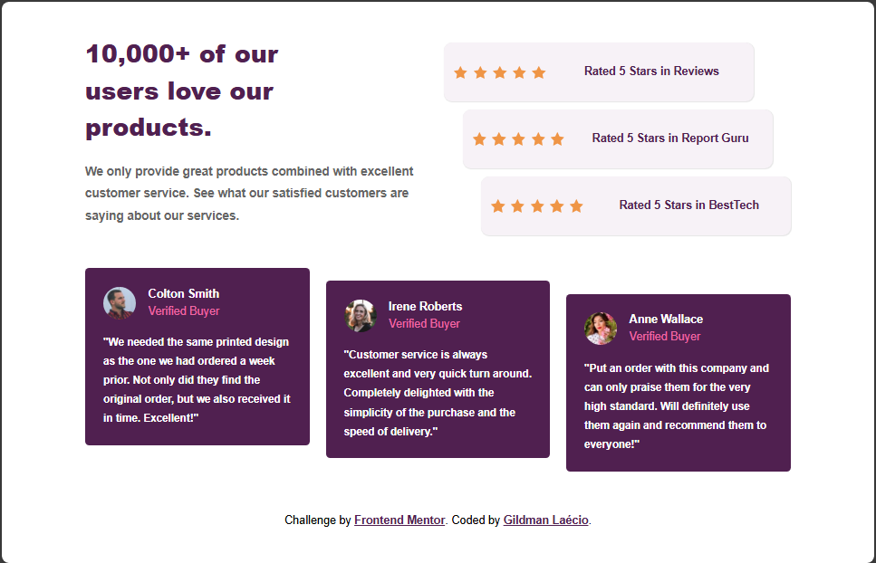
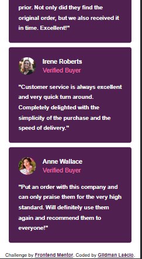

# social-proof-section-master
social-proof-section-master

This is a solution to the [social-proof-section-master challenge on Frontend Mentor](https://www.frontendmentor.io/challenges/social-proof-section-6e0qTv_bA). Frontend Mentor challenges help you improve your coding skills by building realistic projects. 

## Table of contents

- [Overview](#overview)
  - [Screenshot](#screenshot)
  - [Links](#links)
- [My process](#my-process)
  - [Built with](#built-with)
  - [What I learned](#what-i-learned)
  - [Continued development](#continued-development)
- [Author](#author)

## Overview

### Screenshot

These are my screenshots showing how the project turned out.

- For desktop version:

Below 1201px



Above 1201px


- For mobile version:




### Links

- Solution URL: [My Solution](https://gillaercio.github.io/social-proof-section-master/)

## My process

### Built with

- Semantic HTML5 markup
- CSS custom properties
- Grid Layout
- Mobile-first workflow

### What I learned

I took advantage of this project to practice the use of **Grid Layout**:

Conditional Ternary Operator

```css
@media screen and (min-width: 992px) {
  #content {
      width: 896px;
      display: grid;
      align-self: center;
      justify-content: center;
      padding: 10px;
      grid-template-areas: 
      "top-left top-right"
      "base base";
      transition: width 0.5s ease-in-out, height 0.5s ease-in-out;
    }
  
  .top-content {
    display: grid;
    grid-area: top-left;
    width: 440px;
    margin-bottom: 20px;
  }

  .rated-by-stars {
    display: grid;
    grid-template-rows: 1fr 1fr 1fr;
    grid-template-columns: 1fr;
    grid-area: top-right;
    width: 446px;
    padding: 10px;
  }

  #comments {
    display: grid;
    grid-area: base;
    max-width: 896px;
    height: 270px;
  }
}
```

### Continued development

I would like to improve the use of the **Grid Layout** besides studying **Nesting CSS**.

## Author

- Frontend Mentor - [@gillaercio](https://www.frontendmentor.io/profile/gillaercio)
- Github - [My Github](https://github.com/gillaercio)
- LinkedIn - [My LinkedIn](https://www.linkedin.com/in/gildman-la%C3%A9rcio/)